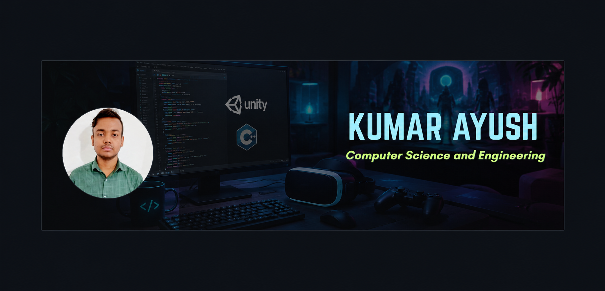

  

<h1 align="center">Hi 👋, I'm Kumar Ayush</h1>
<h3 align="center">Game Developer (Unity/C#) & Front-End Web Developer (React)</h3>

  

- 🔭 I'm currently working on **3D & 2D games in Unity** (zombie shooter, platformer, space game) and **responsive web apps with React, Vite & Tailwind CSS**
- 🤝 I'm looking to collaborate on **Unity/C# game projects** and **React-based front-end applications**
- 🌱 I'm currently learning **Advanced Game AI (NavMesh, FSM), Blender environment design, and AWS**
- 💬 Ask me about **Unity, C#, C++, Blender, React, JavaScript, and DSA**
- 📫 How to reach me: **ayushrnc04@gmail.com** &nbsp; 🌐 LinkedIn | GitHub
- 📄 Know about my experiences: [https://drive.google.com/file/d/1_fBbiKUVPZm_6mfWKUeiKt2HcBgCV7NF/view?usp=sharing](https://drive.google.com/file/d/1_fBbiKUVPZm_6mfWKUeiKt2HcBgCV7NF/view?usp=sharing)
- ⚡ Fun fact: I switch between building zombie-infested 3D worlds in Blender and pixel-perfect React components — sometimes in the same week!

<h3 align="center">🔗 Connect with me</h3>

  
  

<h3 align="center">🛠️ Languages and Tools</h3>

  &nbsp;&nbsp;
  &nbsp;&nbsp;
  &nbsp;&nbsp;
  &nbsp;&nbsp;
  &nbsp;&nbsp;
  &nbsp;&nbsp;
  &nbsp;&nbsp;
  

  &nbsp;&nbsp;
  &nbsp;&nbsp;
  &nbsp;&nbsp;
  &nbsp;&nbsp;
  &nbsp;&nbsp;
  &nbsp;&nbsp;
  

<h3 align="center">📊 GitHub Stats</h3>

  

  

